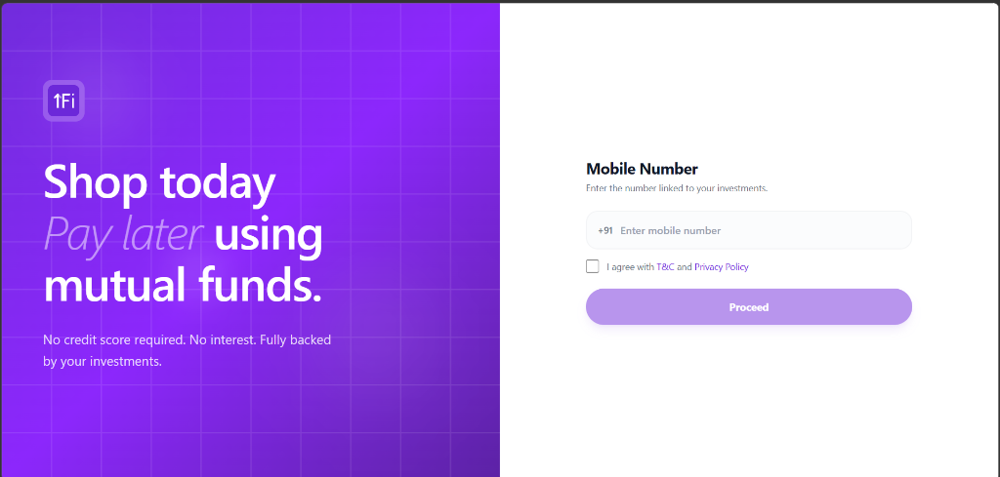
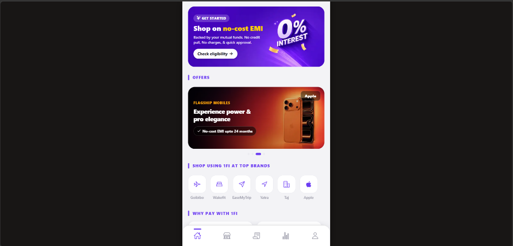
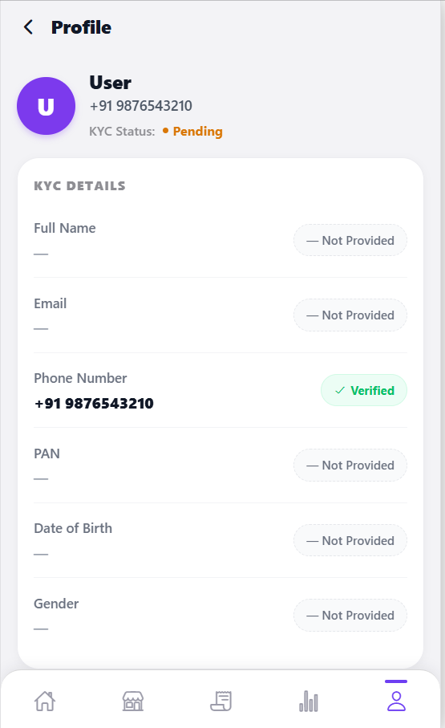
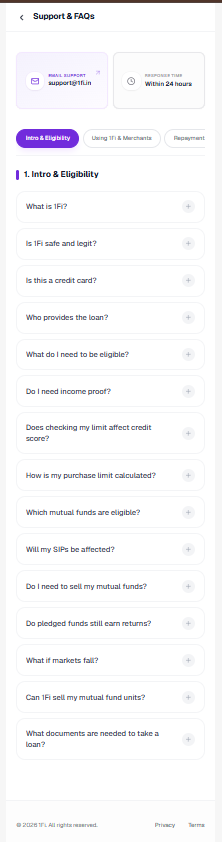
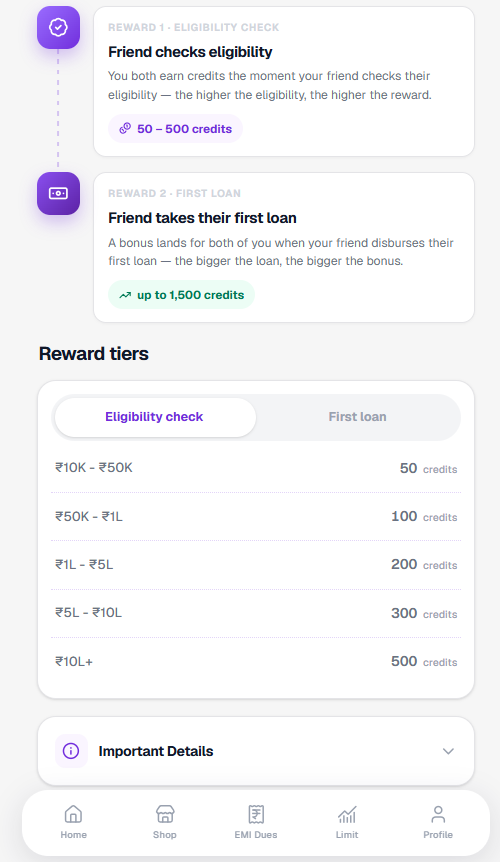
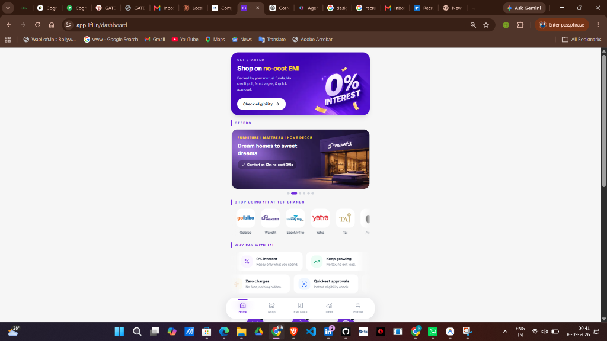

# 1Fi — Shop Today, Pay Later Using Mutual Funds

A mobile-first web application built with **Expo Router** and **React Native for Web**, replicating the [1Fi](https://app.1fi.in/dashboard) experience — a "Buy Now Pay Later" platform backed by mutual fund investments instead of credit scores.

> **Live dev server:** `npx expo start --web` → [http://localhost:8081](http://localhost:8081)

---

## Screenshots

### Login Page (Full-Width Responsive)


### Home Dashboard (Phone Frame)


### Profile & KYC Details


### Support & FAQs


### Refer & Earn


### Reference: 1Fi Production App (app.1fi.in)


---

## Table of Contents

- [Tech Stack](#tech-stack)
- [Getting Started](#getting-started)
- [Project Structure](#project-structure)
- [What Was Implemented](#what-was-implemented)
- [What Was Intentionally Stubbed](#what-was-intentionally-stubbed)
- [Mock Data Layer & How to Replace It](#mock-data-layer--how-to-replace-it)
- [Design Assumptions](#design-assumptions)
- [Ambiguities & How They Were Resolved](#ambiguities--how-they-were-resolved)
- [Key Architecture Decisions](#key-architecture-decisions)

---

## Tech Stack

| Layer | Technology |
|-------|-----------|
| Framework | **Expo SDK 57** + **Expo Router v4** (file-based routing) |
| UI | **React Native 0.86** + **React Native Web 0.21** |
| Language | **TypeScript 6.0** (strict mode) |
| Data Fetching | **TanStack React Query v5** |
| Styling | `StyleSheet.create` + theme tokens (colors, spacing, typography) |
| Icons | `@expo/vector-icons` (Ionicons) |
| State | React Context (`AuthContext`) |

---

## Getting Started

```bash
# Install dependencies
npm install

# Start dev server (web)
npx expo start --web

# Type-check
npm run typecheck
```

The app opens at `http://localhost:8081`. The **login page** is the entry point — enter any 10-digit number, agree to T&C, and tap Proceed.

---

## Project Structure

```
app/
├── login.tsx                    # Full-width responsive login (entry screen)
├── _layout.tsx                  # Root layout: AuthProvider, phone frame, routing
├── +html.tsx                    # Custom HTML shell (dark bg, meta tags)
├── eligibility.tsx              # 4-step eligibility modal (PAN input)
├── (tabs)/
│   ├── _layout.tsx              # Tab navigator (5 visible + 2 hidden tabs)
│   ├── index.tsx                # Home dashboard
│   ├── shop.tsx                 # Shop with 3 segment tabs
│   ├── emi-dues.tsx             # EMI Dues (placeholder)
│   ├── limit.tsx                # Spending Limit (placeholder)
│   ├── profile.tsx              # Profile + KYC details (2 views)
│   ├── refer.tsx                # Refer & Earn (hidden tab)
│   └── faq.tsx                  # Support & FAQs (hidden tab)
└── marketplace/
    ├── product/[id].tsx         # Product detail (variants, EMI plans)
    └── checkout.tsx             # Checkout + order confirmation

src/
├── components/
│   ├── ui/                      # Reusable design system (11 components)
│   ├── marketplace/             # Product cards, EMI selector, variant picker
│   ├── HeroBanner.tsx           # Purple gradient hero with background image
│   ├── OffersCarousel.tsx       # Auto-sliding 4-image carousel
│   └── FaqSection.tsx           # Accordion FAQ for home screen
├── context/
│   └── AuthContext.tsx           # Phone number shared state
├── data/
│   ├── products.mock.ts         # 8 mock products (catalog)
│   └── types.ts                 # Product, Variant, EmiPlan, etc.
├── features/
│   ├── shop/
│   │   ├── MarketplaceTab.tsx   # Product grid with search filtering
│   │   └── PlaceholderTab.tsx   # "Coming soon" stub for other tabs
│   └── marketplace/
│       └── selection.ts         # Variant selection + price resolution logic
├── hooks/
│   └── useMarketplaceProducts.ts # React Query hooks
├── services/
│   ├── marketplaceApi.ts        # Mock API with configurable latency/failure
│   ├── emi.ts                   # EMI calculation (reducing balance formula)
│   └── queryClient.ts           # React Query client config
└── theme/
    ├── colors.ts                # Brand purple (#6D3EF2), surfaces, text, status
    ├── spacing.ts               # 4px-based spacing scale
    ├── typography.ts            # Font sizes & weights
    └── index.ts                 # Re-exports
```

---

## What Was Implemented

### Core Features (Fully Functional)

| Feature | Description |
|---------|-------------|
| **Login Screen** | Full-width responsive layout (side-by-side on desktop, stacked on mobile). Phone number entry with +91 prefix, T&C checkbox, proceeds to home. Phone number persists to profile via `AuthContext`. |
| **Home Dashboard** | Hero banner with background image, offers carousel (4 slides, auto-advancing), top brands horizontal scroll, "Why Pay with 1Fi" feature grid, "How 1Fi Works" 3-step circular icons, refer & earn banner, FAQ accordion section. |
| **Shop / Marketplace** | 3-tab segmented control. Marketplace tab shows 8 products in a 2-column grid with skeleton loading. Full-text search filters by name/brand/category. |
| **Product Detail** | Full product page with image, brand, name, tagline, dynamic pricing. Variant picker (Storage, Color, Memory, etc.) with out-of-stock states. Price recalculates on variant change. |
| **EMI Plan Selection** | Dynamically generated plans based on product price and max no-cost tenure. Reducing-balance EMI formula for interest-bearing plans. Plans reload when variant changes price. |
| **Checkout** | Order summary, selected EMI plan breakdown, confirm flow with 1.2s spinner, success screen with "Back to Shop". |
| **Profile** | Two views — menu (quick actions list) and details (KYC card). Phone number from login shown as verified. 6 KYC fields with verified/not-provided badges. |
| **Eligibility** | 4-step modal flow with PAN input. |
| **Refer & Earn** | Full screen: banner, 3-column stats, referral code with copy/share, earn-twice timeline, reward tiers with tabs, important details accordion. |
| **Support & FAQs** | Full screen: support contact cards, 3 category pills, 15+ FAQ items with expand/collapse. |
| **Error Handling** | All data-fetching screens show contextual error states (network vs. timeout) with retry buttons. EMI plan failures don't blank out product details. |
| **Responsive Web** | Login page is full-width responsive. All other screens render in a centered 440px phone frame with white backdrop. |

### UI Component Library (11 Components)

`Text`, `Button`, `Card`, `Badge`, `Skeleton`, `Screen`, `SearchBar`, `SectionLabel`, `SegmentedTabs`, `StateView`, `ErrorState`

---

## What Was Intentionally Stubbed

| Feature | Current State | Rationale |
|---------|--------------|-----------|
| **Top Brands** tab | Shows "Coming soon" `StateView` | No brand partner data or store integration available. The tab structure is in place — adding real content only requires swapping `PlaceholderTab` for a data-driven component. |
| **Nearby Stores** tab | Shows "Coming soon" `StateView` | Would require geolocation API + store database. Intentionally deferred. |
| **EMI Dues** tab | Placeholder screen | No order/EMI history backend. The checkout flow's success state references this tab. |
| **Limit** tab | Placeholder screen | Would show spending limit based on pledged mutual fund portfolio. Requires portfolio integration. |
| **OTP Verification** | Login proceeds directly on phone number | No SMS/OTP service connected. The login flow accepts any 10-digit number. |
| **T&C / Privacy Policy** | Links are styled but non-functional | No legal document content was provided. |
| **Actual Authentication** | `AuthContext` holds phone number in-memory | No backend auth. State resets on page refresh. A real implementation would use `SecureStore` + JWT tokens. |

---

## Mock Data Layer & How to Replace It

The entire backend is simulated through a **single file**: [`src/services/marketplaceApi.ts`](src/services/marketplaceApi.ts).

### How It Works

```
                    ┌─────────────────────┐
                    │   React Components  │
                    └─────────┬───────────┘
                              │ useMarketplaceProducts()
                              │ useMarketplaceProduct(id)
                              │ useEmiPlans(price, tenure)
                    ┌─────────▼───────────┐
                    │  React Query Hooks  │  ← src/hooks/useMarketplaceProducts.ts
                    │  (caching, retry)   │
                    └─────────┬───────────┘
                              │ fetchMarketplaceProducts()
                              │ fetchMarketplaceProduct(id)
                              │ fetchEmiPlans(price, tenure)
                    ┌─────────▼───────────┐
                    │  marketplaceApi.ts   │  ← THE SEAM (replace this)
                    │  simulateRoundTrip() │
                    └─────────┬───────────┘
                              │
                    ┌─────────▼───────────┐
                    │  products.mock.ts   │  Mock catalog (8 products)
                    │  emi.ts             │  EMI calculation engine
                    └─────────────────────┘
```

### Configuration Knobs

```typescript
// src/services/marketplaceApi.ts
export const marketplaceApiConfig = {
  latencyMs: 650,     // Simulated network delay (ms)
  failureRate: 0,     // 0 = never fail, 1 = always fail, 0.3 = 30% failure
};
```

- Set `failureRate: 1` to test all error UI states
- Set `latencyMs: 3000` to test skeleton loading states
- The failure simulation randomly produces either `'network'` or `'timeout'` errors

### How to Point at a Real API

1. **Replace the three `fetch*` functions** in `marketplaceApi.ts`:

```typescript
// Before (mock):
export async function fetchMarketplaceProducts(): Promise<Product[]> {
  await simulateRoundTrip();
  return [...PRODUCTS];
}

// After (real):
export async function fetchMarketplaceProducts(): Promise<Product[]> {
  const res = await fetch('https://api.1fi.in/v1/marketplace/products');
  if (!res.ok) throw new MarketplaceApiError('network', res.statusText);
  return res.json();
}
```

2. **Keep the `Product`, `EmiPlan`, and `Variant` types** — map your API response to match these interfaces, or update the types to match your API schema.

3. **React Query handles the rest** — caching (1 min stale time), single retry, deduplication, and refetching all work automatically.

4. **EMI calculation** (`emi.ts`) can stay client-side or be replaced with a server endpoint. The `buildEmiPlans()` function uses the standard reducing-balance formula.

---

## Design Assumptions

Since we had no access to the 1Fi source code, design tokens, or component library, these decisions were made by **visual inspection** of the production app at [app.1fi.in/dashboard](https://app.1fi.in/dashboard):

| Assumption | How It Was Resolved |
|-----------|-------------------|
| **Brand purple** | Color-picked from the production UI: `#6D3EF2` for primary, `#EFEAFE` for soft surfaces |
| **Typography** | System fonts (no custom fonts were available). Font weights and sizes were approximated from screenshots |
| **Spacing scale** | 4px-based scale (xs=4, sm=8, md=12, lg=16, xl=24, xxl=32, xxxl=48) derived from visual spacing in the production app |
| **Tab bar design** | Rounded top corners, active indicator bar above icon, matching the production app's bottom navigation |
| **Phone frame** | The production app renders in a phone-shaped container on desktop (max-width ~440px, centered). We replicated this with a wrapping `View` |
| **Card border radius** | Used 16–22px radius based on the rounded card style visible in the production app |
| **Section labels** | Vertical purple bar + purple uppercase text, matching the production app's section header style |
| **Login page** | Full-width responsive (not inside phone frame), matching the reference images provided. Uses the uploaded hero image directly since the text/branding is baked into the asset |

---

## Ambiguities & How They Were Resolved

### 1. Product Images
**Ambiguity:** No product image assets were provided with the assignment.
**Resolution:** Used high-quality Unsplash placeholder URLs for all 8 products. These load from CDN and would be replaced with actual product images from an asset server.

### 2. EMI Plan Generation
**Ambiguity:** The reference material showed EMI plans but didn't specify the calculation method or interest rates.
**Resolution:** Implemented the standard **reducing-balance EMI formula**: `EMI = P·r·(1+r)^n / ((1+r)^n − 1)`. No-cost plans (within `maxNoCostTenure`) use 0% interest; longer tenures use 16% p.a. as a reasonable default.

### 3. Login Flow Depth
**Ambiguity:** Reference images showed a phone number input and "Proceed" button, but no OTP screen or subsequent steps.
**Resolution:** Login accepts any 10-digit number and proceeds directly to the home screen. The phone number is stored in React Context and displayed in the Profile screen as "Verified".

### 4. Refer & Earn Exact Data
**Ambiguity:** Reference screenshots showed referral tiers and credit values but not all data points were fully legible.
**Resolution:** Replicated the visible tier structure (₹10K–₹50K → 50 credits, up to ₹10L+ → 500 credits) and the earn-twice timeline (Reward 1: eligibility check, Reward 2: first loan).

### 5. FAQ Content
**Ambiguity:** FAQ questions were partially visible in screenshots. Full answer text was not available.
**Resolution:** Used the visible question titles and wrote representative answers based on what the 1Fi product does (BNPL backed by mutual funds, no credit score impact, etc.).

### 6. Top Brands vs. Marketplace
**Ambiguity:** The Shop screen shows "Top Brands", "Nearby Stores", and "1Fi Marketplace" tabs, but only the Marketplace had enough reference material to build.
**Resolution:** Implemented the Marketplace tab with full product browsing. Top Brands and Nearby Stores show intentional "coming soon" placeholders to signal they are deferred, not broken.

### 7. Phone Frame on Web
**Ambiguity:** The production app renders in a narrow phone-like container on desktop, but it wasn't clear if this was a deliberate design choice or a viewport limitation.
**Resolution:** Replicated the phone frame (440px max-width, centered) for all screens except the login page, which uses a full-width responsive split layout matching the provided reference.

---

## Key Architecture Decisions

### File-Based Routing (Expo Router)
Every file in `app/` automatically becomes a route. Tab screens live under `app/(tabs)/`. Hidden tabs (Refer, FAQ) use `href: null` to keep them in the navigator (preserving the bottom bar) without showing a tab button.

### Separation of Concerns
- **Data layer** (`services/`, `data/`) is completely independent of UI
- **Hooks** (`hooks/`) wrap React Query, isolating caching/retry logic
- **Features** (`features/`) contain domain-specific UI logic (marketplace grid, selection helpers)
- **Components** (`components/ui/`) are pure, reusable design primitives

### Error Boundary Design
Each data-fetching section has **its own** error state. If EMI plans fail to load, the product details (image, specs, variants) remain visible. This prevents a single API failure from blanking the entire screen.

### Theme Tokens
All colors, spacing, and typography are centralized in `src/theme/`. Components reference tokens like `colors.primary` instead of hardcoding hex values, making theme-wide changes a single-file edit.

---

## Scripts

| Command | Description |
|---------|-------------|
| `npm start` | Start Expo dev server |
| `npm run web` | Start web dev server |
| `npm run typecheck` | Run TypeScript strict-mode check |
| `npm run android` | Start Android dev server |
| `npm run ios` | Start iOS dev server |

---

## License

This project was built as an assessment submission and is not licensed for production use.
